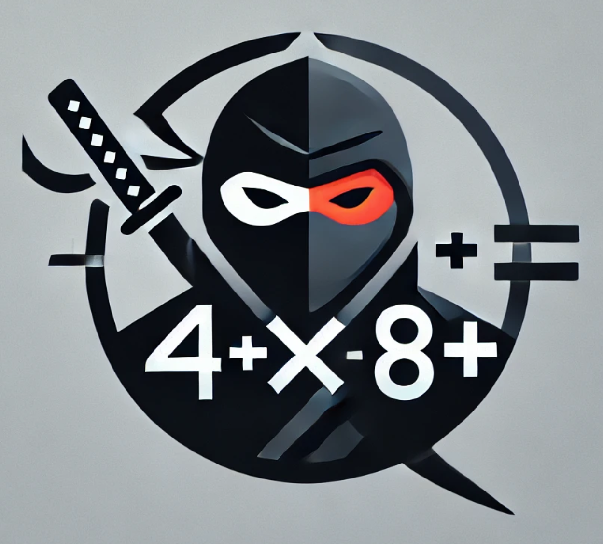

# NumberNinja

NumberNinja is a command-line math training program designed for elementary school students to practice basic arithmetic in German. The program supports addition, subtraction, multiplication, and division, offering a customizable and interactive experience.



## Motivation

As a parent, I wanted to provide my children with a **simple and distraction-free way to practice math** for school. Many educational apps are overloaded with unnecessary features, ads, or gamification that often take away from actual learning.

**NumberNinja** was born out of the need for a **straightforward, effective, and engaging tool** that helps kids improve their arithmetic skills without distractions. By using a **repetition-based learning approach**, mistakes are not just forgotten but reinforced through practice, making learning more efficient.

With a clean command-line interface, NumberNinja allows kids (and adults!) to focus on what truly matters: **mastering math skills in a fun and effective way**.

## Features

- Multiplication: Practice times tables from 1×1 up to 10×10.
- Division: Solve division problems with whole numbers.
- Addition: Practice addition up to 10.
- Subtraction: Improve subtraction skills.
- Error Handling: Incorrect answers are repeated to reinforce learning.
- Statistics: A summary of performance is displayed at the end.
- Customizable Session: Set time limits and select specific arithmetic operations.
- German Language Support: All inputs and outputs are in German.
- Linux Compatible: Executable file runs on Linux systems.

## How to Run

Ubuntu Linux:

```sh
# Download the file from https://github.com/suckowbiz/numberninja Releases.
tar -xf NumberNinja.tar
./NumberNinja
```

Or

```shell
git clone https://github.com/suckowbiz/numberninja.git
cd numberninja
go run main.go
```

## Usage

Once the program starts, you'll be guided through a series of input prompts:

### 1 Set the duration of the exercise

Enter a number for the minutes you want to practice (e.g., `5` for 5 minutes).


### 2 Select arithmetic operations

- Multiplication (0)
- Division (1)
- Addition (2)
- Subtraction (3)
- Multiplication and Division (4)
- Addition and Subtraction (5)
- All operations (6)


### 3 Solve problems

The console will display a problem, for example:

```bash
 1) 8 * 3 =  
```

Enter the correct answer and press `Enter`.  
If you enter an incorrect answer, the problem will be repeated later.

### 4 Final results

After the time is up, the program will display your mistake statistics.

## Project Structure

```plaintext
numberninja/
│── internal/
│   ├── calculus/       # Arithmetic operations & problem generator
│   ├── interaction/    # Command-line interaction
│   ├── school/         # Lesson logic (Lesson, Observer)
│   ├── mistakes/       # Mistake tracking (LIFO stack)
│── main.go             # Program entry point
│── go.mod              # Go module management
```


## License

Licensed under MIT to allow doing anything with proper attribution and without warranty.
